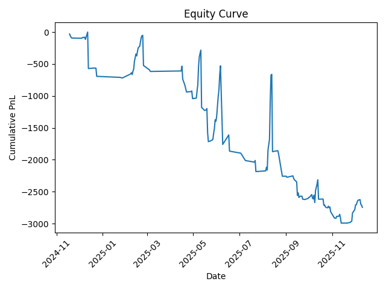
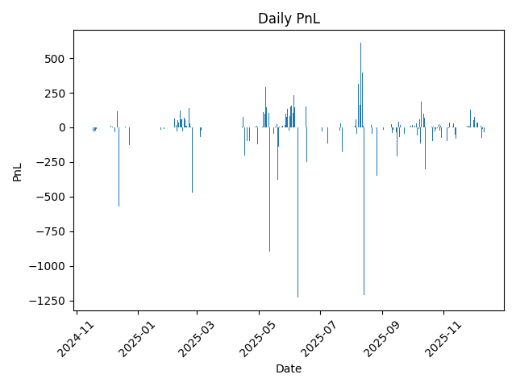
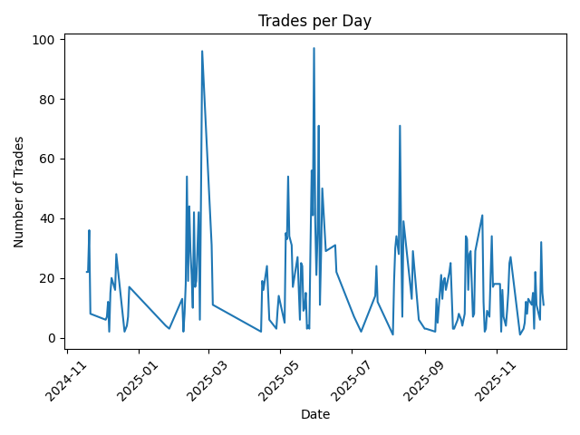
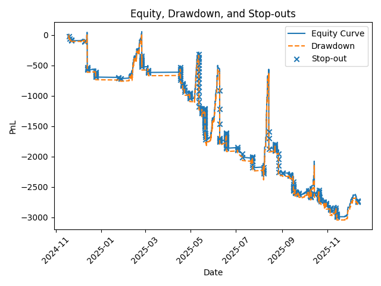
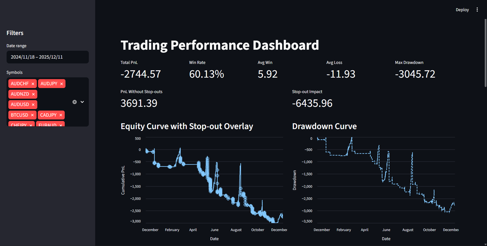
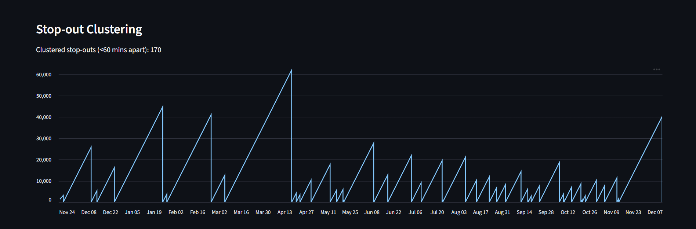

# Trading Performance Analytics Pipeline

## Overview

This project analyzes personal trading performance by transforming raw broker trade exports into structured analytical datasets and visual insights.

The goal is to move beyond isolated trade records and build a reproducible pipeline that reveals how performance, risk, and trading behavior evolve over time.

The system focuses on:

- trade-level standardization  
- daily performance aggregation  
- stop-out impact analysis  
- drawdown tracking  
- activity regime analysis  

Rather than treating trading outcomes as random wins and losses, the project models trading as a behavioral and risk system that can be measured and improved.

---

## Problem

Trading results often get judged only by win rate or total profit, which hides deeper patterns.

A trader may win often and still lose money overall if:

- losses are much larger than wins  
- stop-out events wipe out accumulated gains  
- trading behavior changes under pressure  
- performance deteriorates during unstable periods  

Without a structured data workflow, these patterns remain anecdotal and difficult to verify.

---

## Objective

Build a reproducible analytics pipeline that converts raw broker exports into a clean, queryable dataset and surfaces insights such as:

- total profitability  
- win/loss asymmetry  
- cumulative performance over time  
- drawdown  
- stop-out impact  
- activity-based behavior patterns  

---

## Tech Stack

- Python (data processing)
- dbt (transformations)
- BigQuery (data warehouse)
- Kestra (orchestration)
- Streamlit (dashboard)
- Docker (containerization)

---

## Data Source

The dataset is built from broker CSV exports containing historical trades.

Each raw file includes fields such as:

- ticket  
- opening and closing timestamps  
- side  
- symbol  
- lot size  
- entry and exit price  
- stop loss and take profit  
- commission  
- swap  
- profit  
- close reason  

Older broker history stored in email records is planned as a future enrichment step.

---

## Pipeline Design

The project follows a layered analytical structure:

```
raw → combined → canonical → analytics → mart
```

### Layers

#### Raw  
Original broker CSV exports stored without modification.

#### Combined  
Multiple broker files unified into a single dataset with source tracking.

#### Canonical  
Standardized trade-level dataset with cleaned timestamps and normalized fields.

#### Analytics  
Trade-level metrics such as:

- win rate  
- average win / loss  
- stop-out frequency  
- symbol distribution  
- drawdown  

#### Mart  
Daily aggregated dataset used for time-series analysis:

- daily pnl  
- trade count  
- win/loss counts  
- cumulative pnl  
- overtrading flag  
- stop-out count  

---

## Repository Structure

```
trading-performance-analytics/
│
├── data/
│   ├── raw/                  
│   └── processed/
│
├── docs/
│
├── scripts/
│   ├── build_canonical_combined.py
│   ├── build_canonical_dataset.py
│   ├── build_analytics.py
│   ├── parse_emails.py
│
├── trading_dbt/
│   ├── models/
│   ├── macros/
│   ├── seeds/
│   └── dbt_project.yml
│
├── kestra/
│   └── application.yml
│
├── trading_pipeline.yml
│
├── Dockerfile
├── docker-compose.yml
│
├── dashboard.py
├── README.md
└── .gitignore
```
---

## Reproducibility

This project is fully reproducible using Docker, Kestra, and dbt.

### Prerequisites

- Docker + Docker Compose
- Google Cloud Project with BigQuery enabled
- Service account credentials (JSON)

---

### 1. Clone Repository

```bash
git clone https://github.com/AsherJD-io/trading-performance-analytics.git
cd trading-performance-analytics
```

### 2. Set Up Credentials

Place your GCP service account key in the project root:

```
credentials.json
```
Ensure it has access to:

- BigQuery (Data Editor)
- Storage (if using GCS)

### 3. Build and Start Environment

```
docker compose down -v
docker compose up -d --build
```

This builds a custom Kestra container with:

- Python
- dbt-core
- dbt-bigquery
- required dependencies

### 4. Configure dbt Profile (inside container)

The profile is mounted automatically:

```
/home/kestra/.dbt/profiles.yml
```
Using:

```
trading_dbt:
  target: dev
  outputs:
    dev:
      type: bigquery
      method: service-account
      project: trading-performance-analytics
      dataset: trading_dataset
      threads: 1
      keyfile: /workspace/credentials.json
```

### 5. Run Pipeline via Kestra

Access UI:

<http://localhost:8081>

Run:

```
trading_pipeline
```

### 6. Pipeline Execution Steps

The pipeline performs:

1. Python data processing

- canonical dataset creation
- analytics computation

2. Upload to GCS (optional)

3. dbt transformations

- builds analytical models in BigQuery

### 7. Validate dbt Execution

Inside container:

```
docker exec -it kestra_trading sh
cd /workspace/trading_dbt
dbt debug
dbt run
```

## Notes

- The pipeline uses service account authentication, not OAuth

- Ensure credentials.json is mounted to /workspace

- BigQuery dataset must exist before running dbt


## Output Artifacts
- Processed CSVs → /data/processed/

- dbt models → BigQuery dataset

- Visualizations → /docs/

---

## Processing Flow

1. Raw CSV ingestion  
2. File consolidation into a combined dataset  
3. Canonical schema transformation  
4. Trade-level analytics  
5. Daily mart aggregation  

---

## Core Analytical Findings

### 1. Positive Edge with Negative Outcome

- Total trades: 2967  
- Win rate: 60.13%  
- Total PnL: -2744.57  
- Average win: 5.92  
- Average loss: -11.93  

Profitability is undermined by loss magnitude.

---

### 2. Stop-outs as Primary Risk Driver

- PnL without stop-outs: 3691.39  
- Actual PnL: -2744.57  
- Stop-out impact: -6435.96  

Stop-outs dominate total losses.

---

### 3. Drawdown Behavior

- Max drawdown: -3067.10  

The system shows repeated recovery attempts followed by deeper collapses.

---

### 4. Activity Regime Analysis

Overtrading defined as:

```
trade_count > 40
```

| Regime        | Avg PnL | Avg Trades | Stop-out Rate |
|---------------|--------|-----------|---------------|
| Normal Days   | -28.90 | 15.31     | 29.08%        |
| High Activity | 95.01  | 57.71     | 14.29%        |

Higher activity correlates with better performance, suggesting losses occur during misaligned trading periods rather than excessive activity.

---

## Visual Outputs

### Equity Curve


### Daily PnL


### Trades per Day


### Equity, Drawdown, and Stop-outs


---

## Outputs

- `combined_trades_raw.csv`  
- `canonical_trades.csv`  
- `daily_performance.csv`  
- `daily_performance_enriched.csv`  

---

## Interactive Dashboard

To complement the static visual outputs, an interactive dashboard is provided using Streamlit.

This allows dynamic exploration of:

- equity curve evolution
- daily pnl distribution
- drawdown behavior
- trading activity patterns
- stop-out impact

### Run Locally

```
streamlit run dashboard.py
```





### What it Adds

- drill-down into specific trading periods

- filtering by symbol and time range

- real-time recalculation of metrics

- interactive inspection beyond static charts


This bridges the gap between static analysis and exploratory data analysis, making the system more usable for decision-making.

---

## Future Improvements

- Multi-year dataset expansion  
- Market data integration  
- Enhanced dashboarding  

---

## Summary

This project demonstrates that trading performance is driven not only by win rate but by risk structure and behavioral patterns.

A structured pipeline reveals:

- profit sources  
- loss clustering  
- stop-out impact  
- regime-dependent behavior  

The result is a reproducible system for analyzing trading performance through data rather than intuition.

---

## License

All rights reserved.

This repository is for review and portfolio purposes only.
No part of this codebase may be copied, modified, redistributed, or used commercially without explicit permission.
